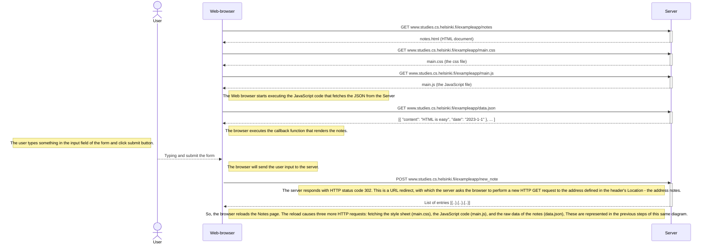

```mermaid
sequenceDiagram
actor User
participant Web-browser
participant Server

Web-browser->>Server: GET www.studies.cs.helsinki.fi/exampleapp/notes
activate Server
Server-->>Web-browser: notes.html (HTML document)
deactivate Server

Web-browser->>Server: GET www.studies.cs.helsinki.fi/exampleapp/main.css
activate Server
Server-->>Web-browser: main.css (the css file)
deactivate Server

Web-browser->>Server: GET www.studies.cs.helsinki.fi/exampleapp/main.js
activate Server
Server-->>Web-browser: main.js (the JavaScript file)
deactivate Server

Note right of Web-browser: The Web browser starts executing the JavaScript code that fetches the JSON from the Server

Web-browser->>Server: GET www.studies.cs.helsinki.fi/exampleapp/data.json
activate Server
Server-->>Web-browser: [{ "content": "HTML is easy", "date": "2023-1-1" }, ... ]
deactivate Server

Note right of Web-browser: The browser executes the callback function that renders the notes.

Note left of User: The user types something in the input  field of the form and click submit button. 
User-->>Web-browser:  Typing and submit the form
activate Web-browser

Note right of Web-browser: The browser will send the user input to the server.

Web-browser->>Server: POST www.studies.cs.helsinki.fi/exampleapp/new_note
activate Server

Note left of Server: The server responds with HTTP status code 302. This is a URL redirect, with which the server asks the browser to perform a new HTTP GET request to the address defined in the header's Location - the address notes.

Server-->>Web-browser: List of entries [{..},{..},{..}]
deactivate Server

Note right of Web-browser: So, the browser reloads the Notes page. The reload causes three more HTTP requests: fetching the style sheet (main.css), the JavaScript code (main.js), and the raw data of the notes (data.json), These are represented in the previous steps of this same diagram.
```