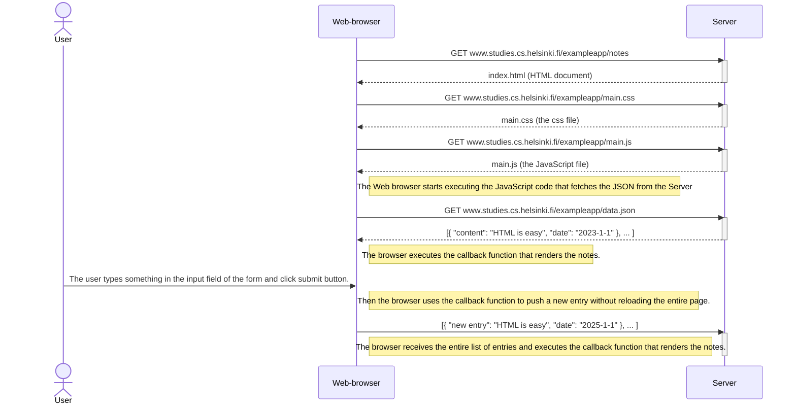

```mermaid
sequenceDiagram
actor User
participant Web-browser
participant Server

Web-browser->>Server: GET www.studies.cs.helsinki.fi/exampleapp/notes
activate Server
Server-->>Web-browser: index.html (HTML document)
deactivate Server

Web-browser->>Server: GET www.studies.cs.helsinki.fi/exampleapp/main.css
activate Server
Server-->>Web-browser: main.css (the css file)
deactivate Server

Web-browser->>Server: GET www.studies.cs.helsinki.fi/exampleapp/main.js
activate Server
Server-->>Web-browser: main.js (the JavaScript file)
deactivate Server

Note right of Web-browser: The Web browser starts executing the JavaScript code that fetches the JSON from the Server

Web-browser->>Server: GET www.studies.cs.helsinki.fi/exampleapp/data.json
activate Server
Server-->>Web-browser: [{ "content": "HTML is easy", "date": "2023-1-1" }, ... ]
deactivate Server

Note right of Web-browser: The browser executes the callback function that renders the notes.


User->>Web-browser: The user types something in the input field of the form and click submit button.
activate User

Note right of Web-browser: Then the browser uses the callback function to push a new entry without reloading the entire page.

Web-browser->>Server: [{ "new entry": "HTML is easy", "date": "2025-1-1" }, ... ]
activate Server

Note right of Web-browser: The browser receives the entire list of entries and executes the callback function that renders the notes.
deactivate Server
```