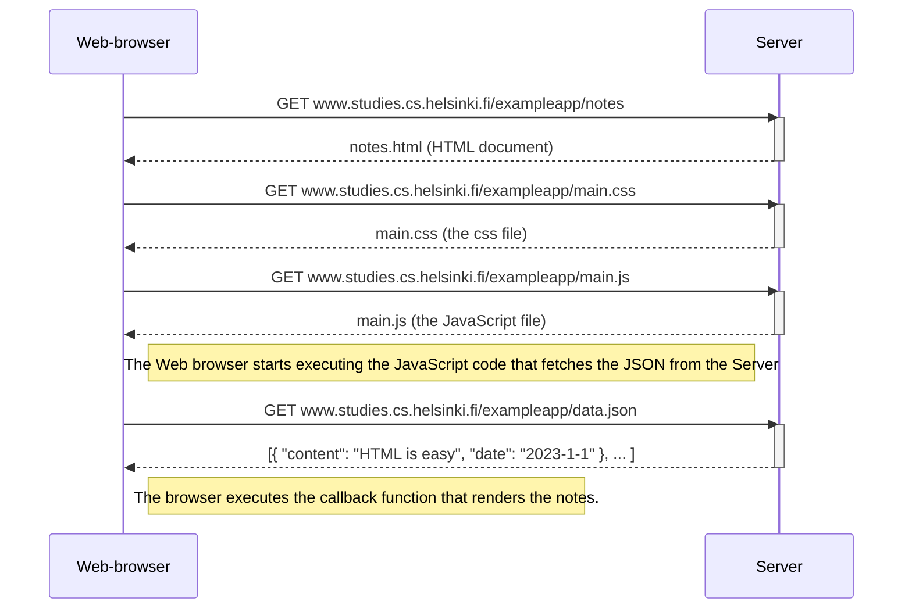

```mermaid
sequenceDiagram 
participant Web-browser
participant Server

Web-browser->>Server: GET www.studies.cs.helsinki.fi/exampleapp/notes
activate Server
Server-->>Web-browser: notes.html (HTML document)
deactivate Server

Web-browser->>Server: GET www.studies.cs.helsinki.fi/exampleapp/main.css
activate Server
Server-->>Web-browser: main.css (the css file)
deactivate Server

Web-browser->>Server: GET www.studies.cs.helsinki.fi/exampleapp/main.js
activate Server
Server-->>Web-browser: main.js (the JavaScript file)
deactivate Server

Note right of Web-browser: The Web browser starts executing the JavaScript code that fetches the JSON from the Server

Web-browser->>Server: GET www.studies.cs.helsinki.fi/exampleapp/data.json
activate Server
Server-->>Web-browser: [{ "content": "HTML is easy", "date": "2023-1-1" }, ... ]
deactivate Server

Note right of Web-browser: The browser executes the callback function that renders the notes.
 
```